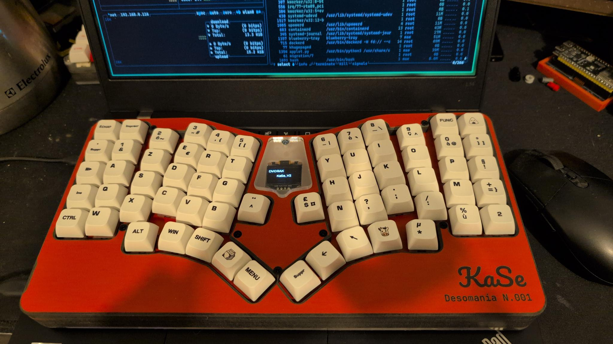
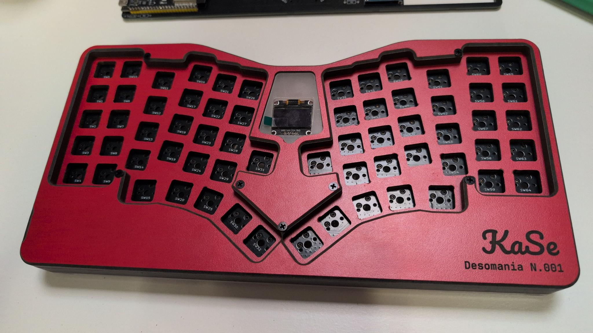
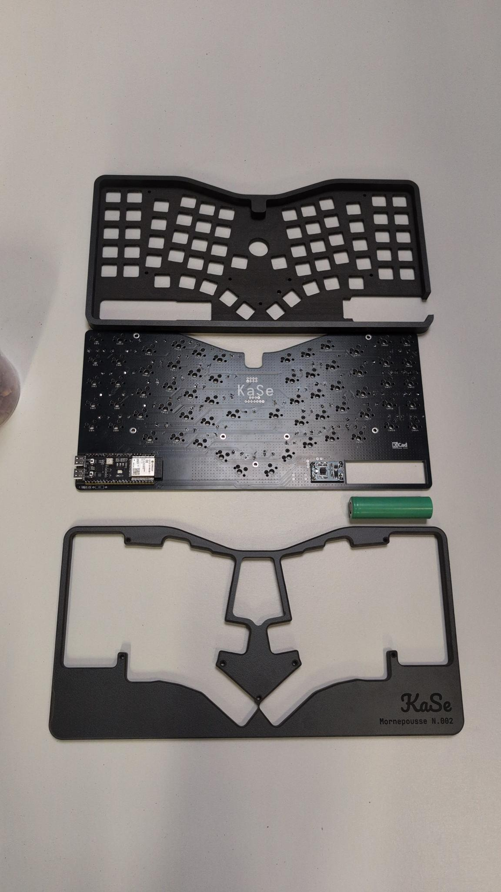
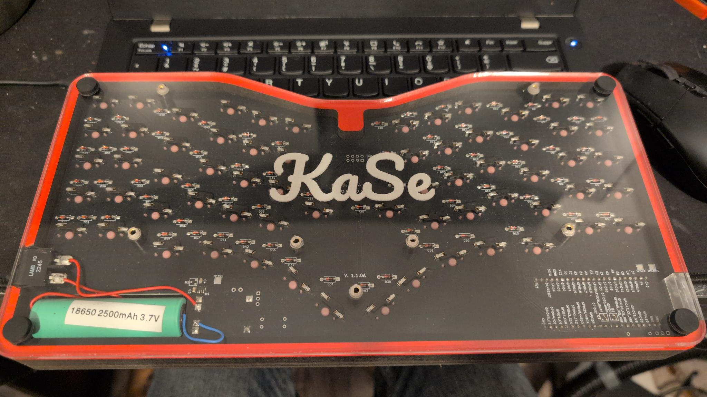

# KaSe – Keyboard Dev Kit

This repository contains the KiCad project and resources for the KaSe keyboard, a compact, column-staggered layout inspired by the Atreus62.

## Project overview

KaSe is designed to be:
- ergonomic, with a compact and column-oriented layout;
- DIY‑friendly, using a single PCB and common components;
- easy to customize (firmware, keymap, and hardware variations).

## Photos

### Main view



Assembled KaSe keyboard with switches and keycaps installed. This picture gives an overview of the final form factor and layout.

### Top view – PCB



Top‑side view of the PCB showing:
- board outline,
- switch positions,
- locations of main components and connectors.

### Routing details



Close‑up of the PCB routing, highlighting:
- main traces and vias,
- matrix rows/columns and power traces,
- silkscreen details and graphics.

### Bottom view



Underside of the PCB or assembly, showing:
- copper pours and ground planes,
- pads and vias,
- possible logos and fabrication information.

## Repository structure

- `Old/` – Legacy Atreus62 project kept for reference.
- `V2/KaSe/` – Current KaSe PCB KiCad project (schematic, PCB, libraries, production files).
- `V2/schematic.crv3d` – 3D/MCAD resources related to the project.
- `README.md` – Project documentation (this file).

## Main KiCad files (KaSe)

Inside `V2/KaSe/`:
- `KaSe.kicad_sch` / `KaSe.sch` – keyboard schematic.
- `KaSe.kicad_pcb` – PCB layout for KaSe.
- `Gerbers/` – production files for PCB manufacturing.
- `footprints.pretty/`, `key.pretty/`, `MaeLid.pretty/`, `PMW3360.pretty/`, `NRF24L01_/` – custom footprints and symbols used in the design.
- `KaSe.kicad_pro` / `KaSe.pro` – KiCad project files.

## Opening the project in KiCad

1. Clone the repository:
	```bash
	git clone https://github.com/mornepousse/KaSe_PCB.git
	cd KaSe_PCB
	```
2. Open KiCad.
3. Open the project file `V2/KaSe/KaSe.kicad_pro`.
4. From KiCad, open the schematic (`KaSe.kicad_sch`) and the PCB (`KaSe.kicad_pcb`).

## PCB fabrication

Gerber files for manufacturing are located in `V2/KaSe/Gerbers/`.

Typical steps:
- Zip the contents of `V2/KaSe/Gerbers/`.
- Upload the ZIP archive to your PCB manufacturer (e.g. JLCPCB).
- Check the PCB preview and confirm the order.

## License and usage

Unless otherwise specified in this repository, this project is provided for personal, experimental, and educational use.  
Please credit the original project if you publish or derive from this design.

---

# KaSe – Kit de développement de clavier

Ce dépôt contient le projet KiCad et les ressources nécessaires pour le clavier KaSe, un clavier compact à colonnes inspiré de l’Atreus62.

## Présentation du projet

Le KaSe est conçu pour être :
- ergonomique, avec une disposition compacte et en colonnes ;
- adapté au DIY, avec un seul PCB et des composants courants ;
- facilement personnalisable (firmware, disposition des touches, variantes matérielles).

## Photos

### Vue principale


Clavier KaSe assemblé avec les switchs et les keycaps installés. Cette photo donne une idée du format final et de la disposition.

### Vue du dessus – PCB


Vue du PCB côté composants montrant :
- le contour de la carte,
- l’implantation des switchs,
- les emplacements des principaux composants et connecteurs.

### Détails du routage


Gros plan sur le routage du PCB mettant en avant :
- les pistes et vias principaux,
- les lignes du matrix (rangées/colonnes) et l’alimentation,
- les détails de sérigraphie et éléments graphiques.

### Vue du dessous


Vue de l’arrière du PCB ou de l’assemblage, montrant :
- les plans de masse et surfaces cuivrées,
- les pastilles et vias,
- les logos et informations de fabrication éventuels.

## Structure du dépôt

- `Old/` – Ancien projet Atreus62 conservé comme référence.
- `V2/KaSe/` – Projet KiCad actuel du PCB KaSe (schéma, PCB, bibliothèques, fichiers de production).
- `V2/schematic.crv3d` – Ressources 3D/CAO liées au projet.
- `README.md` – Documentation du projet (ce fichier).

## Fichiers KiCad principaux (KaSe)

Dans `V2/KaSe/` :
- `KaSe.kicad_sch` / `KaSe.sch` – schémas du clavier.
- `KaSe.kicad_pcb` – routage du PCB KaSe.
- `Gerbers/` – fichiers de production pour la fabrication du PCB.
- `footprints.pretty/`, `key.pretty/`, `MaeLid.pretty/`, `PMW3360.pretty/`, `NRF24L01_/` – bibliothèques de footprints et symboles spécifiques.
- `KaSe.kicad_pro` / `KaSe.pro` – fichiers de projet KiCad.

## Ouvrir le projet dans KiCad

1. Cloner le dépôt :
	```bash
	git clone https://github.com/mornepousse/KaSe_PCB.git
	cd KaSe_PCB
	```
2. Ouvrir KiCad.
3. Charger le projet `V2/KaSe/KaSe.kicad_pro`.
4. Depuis KiCad, ouvrir le schéma (`KaSe.kicad_sch`) puis le PCB (`KaSe.kicad_pcb`).

## Fabrication du PCB

Les fichiers Gerber sont dans `V2/KaSe/Gerbers/`.

Étapes typiques :
- Compresser le contenu de `V2/KaSe/Gerbers/` dans une archive `.zip`.
- Importer cette archive sur le site de ton fabricant de PCB (par ex. JLCPCB).
- Vérifier la prévisualisation puis valider la commande.

## Licence et utilisation

Sauf indication contraire dans ce dépôt, ce projet est fourni pour un usage personnel, expérimental et éducatif.  
Merci de mentionner la source si tu republies ou dérives ce design.

Mae Keyboard DEV Kit version
